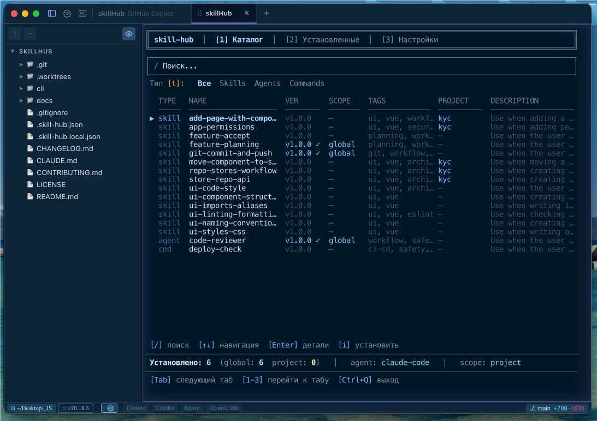
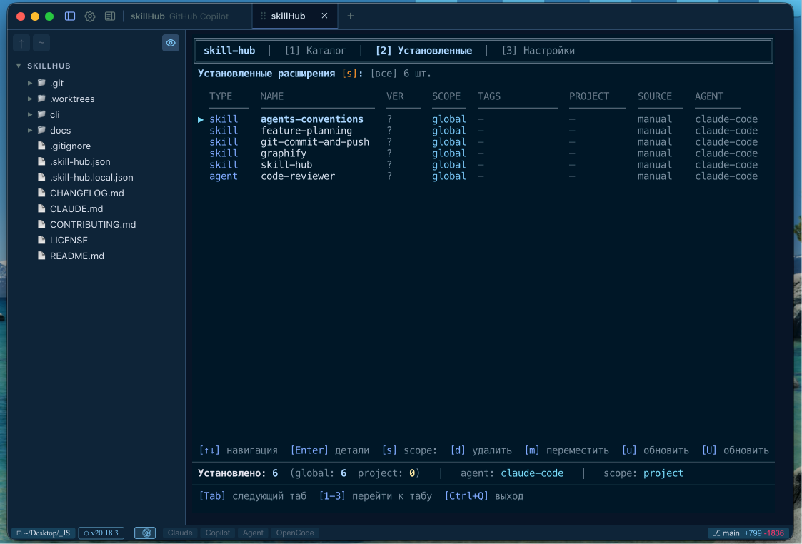
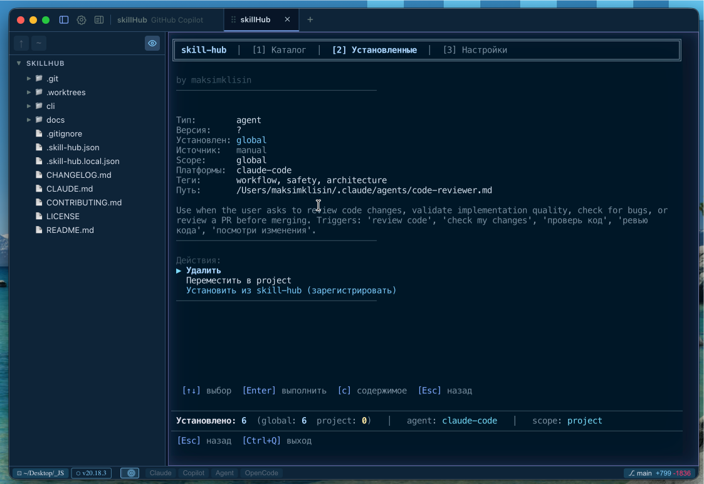
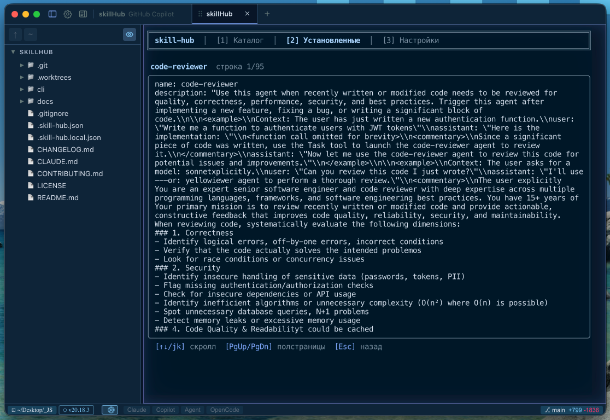
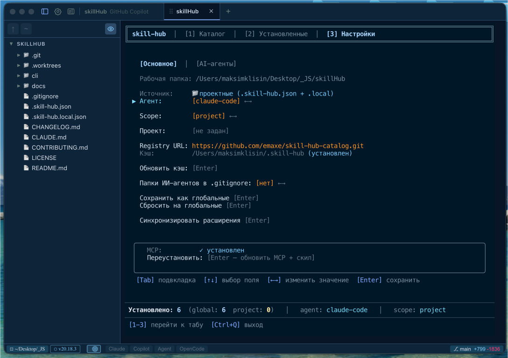
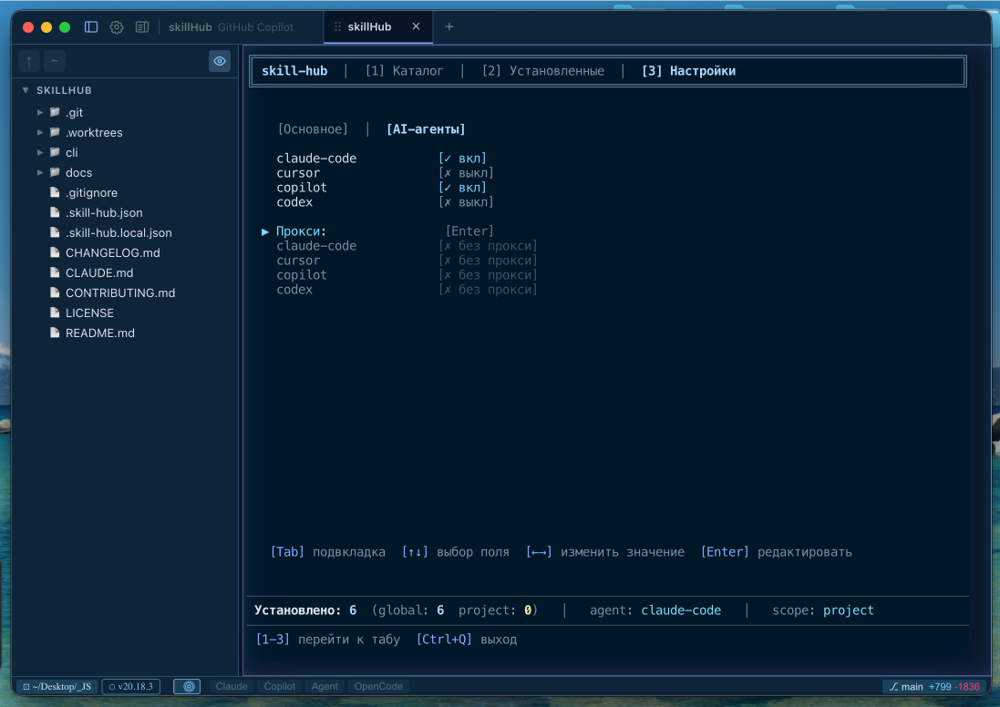

[Russian version](README-ru.md)

# Skill-Hub

Open-source extension manager for AI coding agents. Search, install, and manage skills, agents, and commands from a central catalog.

## Supported AI Agents

| Agent | Status | Directories |
|-------|--------|-------------|
| **Claude Code** | Full support | `~/.claude/` / `.claude/` |
| **Cursor** | Full support | `~/.cursor/` / `.cursor/` |
| **Copilot** (VS Code) | Full support | `~/.config/Code/User/` / `.github/` |
| **Codex** (OpenAI) | Full support | `~/.codex/` / `.codex/` |

Skill-Hub automatically detects the active agent via env vars (`CODEX_SANDBOX` → codex, `GITHUB_COPILOT` → copilot, `CURSOR_TRACE` → cursor) and directory presence (`.codex/`, `.cursor/`). You can also set it explicitly:

```bash
skill-hub config set agent cursor
```

## Supported Platforms

| OS | Status | Notes |
|----|--------|-------|
| **macOS** | Full support | — |
| **Linux** | Full support | — |
| **Windows** | Full support | cmd.exe, PowerShell, Windows Terminal |

### Windows

```powershell
npm install -g @emaxe/skill-hub
```

Windows-specific behavior:

| Component | Behavior |
|-----------|----------|
| Agent launcher `-A` | Generates `.bat` script (CRLF) instead of `.sh`; self-deletes via `del "%~f0"` |
| Copilot adapter | Looks for VS Code config in `%APPDATA%\Code\User\` |
| `agents-conventions enable` | Creates symlinks: `dir` → fallback `junction` → fallback directory copy |
| Path comparison | Case-insensitive (relevant for Claude Code adapter) |

> **Note:** Git Bash and WSL are not target platforms. Native Windows is recommended.

## What Are Extensions?

Skill-Hub manages three types of extensions:

| Type | Description | Example installation (Claude Code) |
|------|-------------|-----------------------------------|
| **Skill** (`SKILL.md`) | AI instructions activated by context | `~/.claude/skills/{name}/SKILL.md` |
| **Agent** (`AGENT.md`) | Specialized AI assistants | `~/.claude/agents/{name}.md` |
| **Command** (`COMMAND.md`) | Custom slash commands | `.claude/commands/{name}.md` |

Each agent stores extensions in its own directory structure. Extensions can declare platform support via the `platforms` field — incompatible combinations are filtered automatically.

### Multi-file Skills

Skills can contain **additional files** besides the main `SKILL.md` — scripts, templates, configurations, data. The entire skill directory is installed and uploaded as a whole.

```
skills/clean-runner/
├── SKILL.md              # Main file (required)
├── runner.sh             # Shell script
├── config.json           # Configuration
├── .skillignore          # Files to exclude (not copied)
└── filters/
    ├── common.grep       # Filter patterns
    └── npm.grep
```

**Installation behavior:**

| Adapter | Main file | Additional files |
|---------|-----------|------------------|
| Claude Code / conventions | Full directory copied | In the same directory |
| Cursor | Transformed (Cursor frontmatter) | Copied as-is |
| Copilot | Marker-injection into config | `.github/skills/{name}/` |
| Codex | Marker-injection into config | `.codex/skills/{name}/` |

**`.skillignore`** — files excluded from copying (the `.skillignore` file itself is also not copied). Symlinks are ignored. Maximum directory size is 1 MB; binary files are prohibited when uploading to the catalog.

## Quick Start

### Option A: CLI + MCP (recommended)

```bash
npm install -g @emaxe/skill-hub

# Configure for your agent (claude-code | cursor | copilot | codex)
skill-hub setup-mcp --agent claude-code
```

After restarting the agent, MCP tools will be available automatically.

### Option B: Bootstrap skill (manual)

```bash
# For Claude Code:
mkdir -p ~/.claude/skills/skill-hub
cp "$(npm root -g)/@emaxe/skill-hub/base-skills/claude-code/SKILL.md" ~/.claude/skills/skill-hub/SKILL.md

# For Cursor:
mkdir -p ~/.cursor/skills/skill-hub
cp "$(npm root -g)/@emaxe/skill-hub/base-skills/cursor/SKILL.md" ~/.cursor/skills/skill-hub/SKILL.md

# For Codex:
mkdir -p ~/.codex
cp "$(npm root -g)/@emaxe/skill-hub/base-skills/codex/SKILL.md" ~/.codex/AGENTS.md
```

## Installing Skills from skills.sh

Skill-Hub supports direct installation of skills from [skills.sh](https://skills.sh) — a public AI skills registry by Vercel Labs. This works **only via CLI** (TUI does not yet support external sources).

### Search

```bash
skill-hub search --source skillssh react --limit 5
```

### Installation Formats

```bash
# By full ID (recommended)
skill-hub install skillssh:vercel-labs/agent-skills@vercel-react-best-practices --agent claude-code --project

# By slug (skills.sh searches by ID)
skill-hub install skillssh:vercel-react-best-practices --agent claude-code --project

# By owner/repo — lists skills if multiple exist in the repo
skill-hub install skillssh:vercel-labs/agent-skills --agent claude-code --project
```

### How It Works

1. CLI calls `https://skills.sh/api/search` or `download` API
2. Downloads all skill files to a temporary directory
3. Installs via the standard adapter (like a regular catalog skill)
4. Saves `source: "skillssh:owner/repo@slug"` in the registry for updates

### Update

```bash
# Update all skills (including skills.sh)
skill-hub update --agent claude-code

# Update a specific skills.sh skill
skill-hub update vercel-react-best-practices --agent claude-code
```

For skills.sh skills, the update compares the hash from the API — if changed, it re-downloads and reinstalls.

## Interactive TUI

Run `skill-hub` without arguments for a fullscreen interface:

```bash
skill-hub
```

> **Minimum terminal size:** 60×12. TUI adapts to window size:
> at width < 80 cols secondary table columns are hidden and labels are shortened;
> at height < 16 rows the stats panel is hidden.



### General Navigation

| Key | Action |
|-----|--------|
| `Tab` / `Shift+Tab` | Switch tabs |
| `1` / `2` / `3` | Direct jump: Catalog / Installed / Settings |
| `Esc` | Back (on nested screens) |
| `Ctrl+Q` | Exit |

### Catalog Tab

Search and install extensions from the catalog.

| Key | Action |
|-----|--------|
| `/` | Focus search field |
| `↑` `↓` | Navigate list |
| `Enter` | Open extension card |
| `i` | Install selected extension |

The search field supports type filters: `agent:reviewer`, `skill:git`.

### Installed Tab

Manage installed extensions.

| Key | Action |
|-----|--------|
| `↑` `↓` | Navigate list |
| `Enter` | Open extension card |
| `d` | Delete extension (with confirmation) |
| `m` | Move (global ↔ project) |
| `u` | Update selected extension |
| `U` | Update all extensions |
| `p` | Upload to catalog (if you have access) |
| `/` | Focus search field |
| `s` | Toggle scope (global / project / all) |



Pressing `Enter` opens the extension card with detailed info and available actions:



From the card you can view the extension file content (`c`):



### Settings Tab

Two sub-tabs: **General** and **AI Agents**.

#### General Sub-tab

| Field | Key | Description |
|-------|-----|-------------|
| Agent | `←` `→` | Switch between claude-code, cursor, copilot, codex, agents-conventions |
| Scope | `←` `→` | Default scope: global or project |
| Project | — | Current project name |
| Registry URL | `Enter` | Edit catalog repository URL |
| Update cache | `Enter` | Download latest catalog version |
| AI agent dirs in .gitignore | `←` `→` | Add agent directories to .gitignore (project config only) |
| Install MCP | `Enter` | Register MCP server for current agent |
| Install base skill | `Enter` | Install bootstrap skill |
| Update CLI | `Enter` | Update skill-hub itself to the latest version |
| Save as global | `Enter` | Copy project config to global |
| Reset to global | `Enter` | Restore project config from global |
| Sync | `Enter` | Check missing/untracked extensions |



#### AI Agents Sub-tab

Configure AI agent launch through skill-hub:

| Field | Key | Description |
|-------|-----|-------------|
| claude-code / cursor / copilot / codex | `←` `→` | Enable/disable agent |
| Proxy URL | `Enter` | Common proxy for all agents |
| Use proxy (per-agent) | `←` `→` | Toggle proxy for a specific agent |



### Upload to Catalog Screen

Upload your own extensions to the catalog repository.

| Key | Action |
|-----|--------|
| `↑` `↓` | Navigate extension list |
| `Space` | Select/deselect extension |
| `a` | Select all |
| `s` | Toggle scope (global / project) |
| `c` | View selected extension content |
| `b` | Edit branch name |
| `e` | Edit PR title |
| `Enter` | Start upload |
| `Esc` | Back |

After upload:
| `o` | Open link to create a merge request in the browser |

### Sync Dialog

When starting TUI, extensions are automatically checked against the project config (`.skill-hub.json`). If discrepancies are found, a dialog appears:

- **Missing** — extensions from config not present on disk
- **Untracked** — extensions on disk not in config

| Key | Action |
|-----|--------|
| `Enter` | Sync (install + add to config) |
| `p` | Upload to catalog (for extensions not in the catalog) |
| `Esc` | Skip |

### .gitignore Dialog

If `gitignoreAgentDirs` is enabled in the project config, TUI checks whether all AI agent folders (`.claude/`, `.cursor/`, `.github/`, `.codex/`, `.agents/`, `.cursorrules`) are added to `.gitignore`. If any are missing, a dialog appears:

| Key | Action |
|-----|--------|
| `Enter` | Add to .gitignore |
| `Esc` | Skip |

> **Note:** all hotkeys work in Russian keyboard layout (й→q, ц→w, у→e, etc.)

## Working with AI Agents

### Connecting via MCP

The MCP server provides 7 tools for managing extensions from within an AI agent:

```bash
# Automatic setup
skill-hub setup-mcp --agent claude-code
```

After setup, the agent gets access to:
- `search_extensions` — catalog search
- `install_extension` — installation with automatic dependency resolution
- `remove_extension` — removal
- `move_extension` — move between scopes
- `list_extensions` — list installed
- `suggest_extensions` — project-based recommendations
- `get_extension_info` — full extension info

### Proxy Configuration

If AI agents work through a proxy (e.g., for API access):

**Via TUI:**
1. Open **Settings** → **AI Agents** sub-tab
2. Go to **Proxy URL** → press `Enter`
3. Enter the proxy URL
4. Enable "Use proxy" for the desired agents

**Via CLI:**
```bash
skill-hub config set aiAgents.proxy "http://proxy.example.com:8080"
```

### Launching AI Agents via Skill-Hub

Skill-Hub can launch AI agents directly, applying proxy and other settings:

```bash
# Launch via exec
skill-hub -a claude-code "write a test for auth.ts"

# Launch via temporary script
skill-hub -A cursor "review this code"
```

## Switching Catalog Repository

By default skill-hub uses the catalog at `https://github.com/emaxe/skill-hub-catalog.git`. You can switch to your own fork or corporate catalog.

### Via TUI

1. Open **Settings** → **Registry URL** → `Enter`
2. Enter the new repository URL (HTTPS or SSH)
3. Confirm — old cache will be removed
4. Catalog will auto-download from the new repository

> When switching repositories, the extension list in the project config `.skill-hub.json` will be cleared since they are tied to a specific catalog. Extension files on disk will remain.

### Via CLI

```bash
skill-hub config set registryUrl "https://gitlab.example.com/team/my-catalog.git"
```

### Catalog Requirements

Your catalog must contain:
- `catalog.json` — extension index (auto-generated by `skill-hub-catalog` scripts)
- Directories `skills/`, `agents/`, `commands/` with extensions

A history of used URLs is kept (up to 6 entries) and available when editing via TUI.

## Uploading Extensions to the Catalog

You can upload your own extensions to the catalog repository directly from skill-hub.

### Prerequisites

- You have **write access** to the catalog repository (git push)
- The extension has a filled **frontmatter** (name, description, version, author)

> **Note:** built-in base CLI skills (`skill-hub`, `agents-conventions`, `init-agents`, `exit-agents`) are automatically excluded from the upload candidate list.

### Upload Process

1. **Open the upload screen** via one of:
   - In the **Installed** tab press `p`
   - In an installed extension card select "Upload to catalog"
   - In the sync dialog press `p` (for extensions not in the catalog)

2. **Select extensions** to upload:
   - `Space` — select/deselect
   - `a` — select all
   - `s` — toggle scope
   - `c` — preview content before upload

3. **Configure options:**
   - Branch name (auto: `upload/{username}-{timestamp}`)
   - PR title (auto-generated from selected extensions)

4. **Press `Enter`** to upload — extensions will be:
   - Validated (frontmatter, kebab-case names)
   - Copied into the catalog structure
   - Committed and pushed to a separate branch

5. **Create a merge request** — press `o` to open the MR/PR form in the browser

### Frontmatter Format

```yaml
---
name: my-extension
description: "Extension description"
version: 1.0.0
author: "Author Name"
tags: tag1, tag2, tag3
platforms: claude-code, cursor
---
```

## Agents-Conventions Mode

Mode for multi-agent projects — a shared `.agents/` directory with extensions available to all agents via symlinks.

### Enabling

```bash
skill-hub agents-conventions enable
```

Or via TUI: Settings → Agent → `agents-conventions` → Init Conventions.

What happens:
- `.agents/` is created with `skills/`, `agents/`, `commands/` subdirectories
- `AGENTS.md` is created (common project rules)
- Symlinks are created: `.claude/` → `.agents/`, `.cursor/` → `.agents/`, `.codex/` → `.agents/`
- For Copilot a thin pointer is created at `.github/copilot-instructions.md`
- Bootstrap skill `agents-conventions` is installed globally in all AI agents
- Skills `init-agents` / `exit-agents` are installed to `~/.skill-hub/bootstrap/`

### Disabling

```bash
skill-hub agents-conventions disable
```

Extensions migrate back to individual agent directories, symlinks are removed.

## CLI Commands Reference

### search

Search extensions by name, tags, keywords.

```bash
skill-hub search git
skill-hub search agent:reviewer
skill-hub search "testing typescript"
```

### install

Install an extension. Without prefix — skill, with prefix — by type.

```bash
skill-hub install git-commit-and-push
skill-hub install agent:code-reviewer
skill-hub install command:deploy-check
skill-hub install git-helper --scope=global
skill-hub install git-helper -y              # no confirmation
```

### remove

Remove an installed extension.

```bash
skill-hub remove git-commit-and-push
skill-hub remove agent:code-reviewer
```

### list

List installed extensions with versions and scope.

```bash
skill-hub list
skill-hub list --type=agent
```

### move

Move an extension between scopes.

```bash
skill-hub move git-helper project
skill-hub move agent:code-reviewer global
```

### info

Detailed info about a catalog extension.

```bash
skill-hub info git-commit-and-push
skill-hub info agent:code-reviewer
```

### update

Update extensions to the latest versions.

```bash
skill-hub update                     # update all
skill-hub update agent:code-reviewer # update specific
skill-hub -u code-reviewer           # shorthand
skill-hub -U                         # update all (shorthand)
```

### config

Manage configuration.

```bash
skill-hub config set agent cursor
skill-hub config set registryUrl "https://gitlab.example.com/catalog.git"
skill-hub config set defaultScope global
skill-hub config get agent
skill-hub config reset
```

### setup-mcp

Register MCP server for an AI agent.

```bash
skill-hub setup-mcp --agent claude-code
skill-hub setup-mcp --agent cursor
skill-hub setup-mcp --agent copilot
skill-hub setup-mcp --agent codex
```

### agents-conventions

Manage multi-agent mode.

```bash
skill-hub agents-conventions enable
skill-hub agents-conventions disable
```

### help

Full help on commands, flags, and options.

```bash
skill-hub help
skill-hub -h
skill-hub --help
```

### Special Flags

```bash
skill-hub -a claude-code "task"   # launch agent via exec
skill-hub -A cursor "task"        # launch via temp script
skill-hub --then                     # chain two commands
```

## Project Config (`.skill-hub.json`)

The `.skill-hub.json` file in the project root allows you to:
- Pin the set of extensions for the project (team sync)
- Override global settings for a specific project
- Auto-sync extensions when opening the project in TUI
- Control adding AI agent folders to `.gitignore`

```json
{
  "registryUrl": "https://github.com/emaxe/skill-hub-catalog.git",
  "project": "my-project",
  "gitignoreAgentDirs": true,
  "extensions": [
    { "type": "skill", "name": "git-commit-and-push", "version": "1.0.0", "scope": "project" },
    { "type": "agent", "name": "code-reviewer", "version": "1.0.0", "scope": "global" }
  ]
}
```

Colleagues cloning the project will see the sync dialog on first `skill-hub` launch and can auto-install all listed extensions.

## Architecture

```
skill-hub (this repo)
├── cli/                     # CLI + MCP server (npm: @emaxe/skill-hub)
│   ├── src/
│   │   ├── adapters/        # Agent adapters (claude-code, cursor, copilot, codex)
│   │   ├── commands/        # CLI commands
│   │   └── tui/             # Interactive TUI (Ink/React)
│   └── base-skills/         # Bootstrap skills for each agent
├── docs/                    # Feature documentation
└── CLAUDE.md                # Instructions for AI agents

skill-hub-catalog (separate repo)
├── skills/                  # Published skills
├── agents/                  # Published agents
├── commands/                # Published commands
├── catalog.json             # Auto-generated index
├── schema/                  # Frontmatter validation schemas
└── docs/                    # Extension creation guides
```

**Delivery flow:**
1. `git clone --depth 1 skill-hub-catalog` → `~/.skill-hub/` (local cache)
2. Installation = adapter copies extension to the agent's target directory
3. Update = `git pull` in cache, re-copy installed extensions

## Local CLI Development

```bash
cd cli && npm run build       # build
npm link                      # global link
skill-hub search git          # test
npm unlink -g @emaxe/skill-hub # remove link
cd cli && npm test            # tests (266 tests)
```

After source changes, just rebuild (`npm run build`) — the link updates automatically.

## Contributing

Extensions (skills, agents, commands) are published to [skill-hub-catalog](https://github.com/emaxe/skill-hub-catalog). See the `docs/` directory there for creation guides.

For CLI improvements — open a PR in this repository. Details in [CONTRIBUTING.md](CONTRIBUTING.md).

## License

[MIT](LICENSE)
