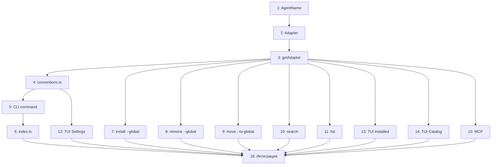

# План реализации: AGENTS-CONVENTIONS Mode

## Обзор

Реализация нового режима работы `agents-conventions` для skill-hub CLI. Основные блоки:
1. Расширение типов и создание адаптера
2. CLI-команда enable/disable/status
3. Адаптация существующих команд
4. TUI-интеграция
5. MCP-интеграция

## Задачи

### Блок 1 — Фундамент: типы и адаптер (последовательно)

| # | Задача | Файлы | Зависит от | Режим выполнения | Проверка |
|---|--------|-------|------------|------------------|----------|
| 1 | Расширить AgentName: добавить `'agents-conventions'` в тип | `cli/src/catalog.ts` | — | sequential | `npm run build` |
| 2 | Создать AgentsConventionsAdapter — реализация AgentAdapter | `cli/src/adapters/agents-conventions.ts` | 1 | sequential | `npm run build` |
| 3 | Зарегистрировать адаптер в getAdapter | `cli/src/adapters/get-adapter.ts` | 2 | sequential | `npm run build` |

### Блок 2 — CLI-команда agents-conventions (последовательно после #3)

| # | Задача | Файлы | Зависит от | Режим выполнения | Проверка |
|---|--------|-------|------------|------------------|----------|
| 4 | Создать модуль инициализации/деинициализации конвенции: функции `enableConventions()`, `disableConventions()`, `getConventionsStatus()` — вся логика создания директорий, симлинков, указателей, миграции расширений | `cli/src/conventions.ts` | 3 | sequential | `npm run build` |
| 5 | Создать CLI-команду `agents-conventions enable/disable/status` | `cli/src/commands/agents-conventions.ts` | 4 | sequential | `npm run build`, ручной тест `skill-hub agents-conventions status` |
| 6 | Зарегистрировать команду в index.ts | `cli/src/index.ts` | 5 | sequential | `skill-hub agents-conventions --help` |

### Блок 3 — Адаптация существующих команд (параллельно после #3)

| # | Задача | Файлы | Зависит от | Режим выполнения | Проверка |
|---|--------|-------|------------|------------------|----------|
| 7 | Добавить проверку --global в install: ошибка при agents-conventions | `cli/src/commands/install.ts` | 3 | parallel-subagent | `npm run build` |
| 8 | Добавить проверку --global в remove | `cli/src/commands/remove.ts` | 3 | parallel-subagent | `npm run build` |
| 9 | Добавить проверку --to-global в move | `cli/src/commands/move.ts` | 3 | parallel-subagent | `npm run build` |
| 10 | Адаптировать search: фильтрация по claude-code платформе при agents-conventions | `cli/src/commands/search.ts` | 3 | parallel-subagent | `npm run build` |
| 11 | Адаптировать list: корректное отображение agents-conventions расширений | `cli/src/commands/list.ts` | 3 | parallel-subagent | `npm run build` |

### Блок 4 — TUI (последовательно после #4, параллельно с блоком 3)

| # | Задача | Файлы | Зависит от | Режим выполнения | Проверка |
|---|--------|-------|------------|------------------|----------|
| 12 | Добавить 'agents-conventions' в AGENTS массив в SettingsScreen, адаптировать поведение scope при agents-conventions | `cli/src/tui/screens/SettingsScreen.tsx` | 4 | sequential | `npm run build`, визуальная проверка TUI |
| 13 | Добавить метку «all agents» в InstalledScreen для agents-conventions расширений | `cli/src/tui/screens/InstalledScreen.tsx` | 3 | parallel-same | `npm run build` |
| 14 | Адаптировать CatalogScreen: фильтрация при agents-conventions | `cli/src/tui/screens/CatalogScreen.tsx` | 3 | parallel-same | `npm run build` |

### Блок 5 — MCP (параллельно после #3)

| # | Задача | Файлы | Зависит от | Режим выполнения | Проверка |
|---|--------|-------|------------|------------------|----------|
| 15 | Адаптировать MCP-инструменты: поддержка agents-conventions в install/remove/list/suggest | `cli/src/mcp.ts` | 3 | parallel-subagent | `npm run build` |

### Блок 6 — Финализация (последовательно после всех)

| # | Задача | Файлы | Зависит от | Режим выполнения | Проверка |
|---|--------|-------|------------|------------------|----------|
| 16 | Интеграционная проверка: полный цикл enable → install → list → remove → disable | — | 6, 7–11, 12–14, 15 | sequential | Ручной тест полного сценария |

## Стратегия выполнения

**Порядок:** Блоки 1 → 2 строго последовательно (фундамент + команда). После задачи #3 (getAdapter) параллельно запускаются блоки 3, 4 (частично), 5. После задачи #4 (conventions.ts) запускается блок 4 (#12). Блок 6 — после завершения всех.

## Ревью после каждого шага

- После каждой задачи — сверка с `plan.md` и `spec.md` (скоуп, критерии приёмки).
- Проверка, что изменения не конфликтуют с параллельно выполняемыми задачами (одни и те же файлы, противоречивая логика).
- Если задачу делал субагент — основной агент проводит ревью результата перед следующим шагом.
- После каждого блока — `npm run build` для проверки компиляции.
