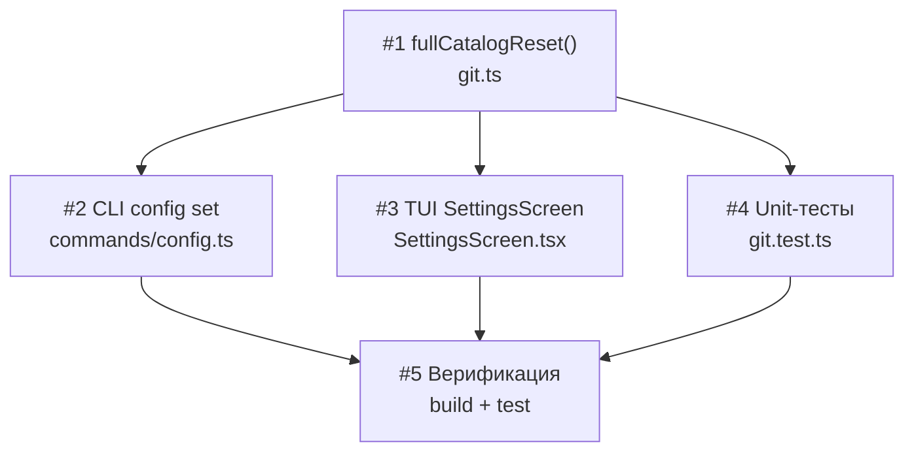

# План реализации: Очистка расширений при смене репозитория каталога

## Обзор

Фича состоит из 3 слоёв: ядро (функция `fullCatalogReset`), интеграция в два UI (CLI и TUI), тесты. Ядро — одна функция в `git.ts`. Интеграция в CLI и TUI независима друг от друга — можно параллелить.

## Задачи

### Блок 1 — Ядро (последовательно)

| # | Задача | Файлы | Зависит от | Режим выполнения | Проверка |
|---|--------|-------|------------|------------------|----------|
| 1 | Создать `fullCatalogReset()` в `git.ts`. Функция: (1) загружает расширения через `loadProjectExtensions()`, (2) если есть — вызывает `saveProjectExtensions([])` в try-catch (при ошибке — console.warn), (3) вызывает `resetCache()`. Добавить JSDoc на русском. Импортировать `loadProjectExtensions`, `saveProjectExtensions`, `findProjectRoot` из `./config`. Экспортировать функцию. | `cli/src/git.ts` | — | sequential | `npm run build` |

### Блок 2 — Интеграция в UI (параллельно после #1)

| # | Задача | Файлы | Зависит от | Режим выполнения | Проверка |
|---|--------|-------|------------|------------------|----------|
| 2 | CLI: в `config set` при `key === 'registryUrl'` — перед сменой URL проверить `loadProjectExtensions().length`. Если > 0: показать предупреждение (chalk.yellow, кол-во расширений, путь проекта из `findProjectRoot()`) и запросить readline-подтверждение (паттерн `askQuestion` из `agents-conventions.ts`). При отказе — `process.exit(0)`. Добавить флаг `--yes` / `-y` к подкоманде `set` (через `.option('--yes', ...)`), при его наличии — пропустить подтверждение. Заменить `resetCache()` на `fullCatalogReset()`. Сделать action `async`. | `cli/src/commands/config.ts` | 1 | parallel-subagent | `skill-hub config set registryUrl https://test.url --yes` (проверить вывод) |
| 3 | TUI: в `SettingsScreen.tsx` добавить state `showResetConfirm` (boolean) и `pendingRegistryUrl` (string). В обоих местах, где вызывается `resetCache()` при `urlChanged`: вместо прямого вызова — проверить `loadProjectExtensions().length > 0`; если да — установить `showResetConfirm=true`, сохранить новый URL в `pendingRegistryUrl`; если нет — вызвать `fullCatalogReset()` напрямую. Добавить рендер `Confirm` компонента (из `../components/Confirm`) при `showResetConfirm`: message с количеством расширений; `onConfirm` — вызвать `fullCatalogReset()`, применить конфиг; `onCancel` — откатить `localRegistryUrl` на `config.registryUrl`, скрыть Confirm. Импортировать `fullCatalogReset` из `../../git` и `Confirm` из `../components/Confirm`. | `cli/src/tui/screens/SettingsScreen.tsx` | 1 | parallel-subagent | Запуск TUI, смена registryUrl → модальное подтверждение |

### Блок 3 — Тесты и верификация (после #1; частично параллельно с блоком 2)

| # | Задача | Файлы | Зависит от | Режим выполнения | Проверка |
|---|--------|-------|------------|------------------|----------|
| 4 | Написать unit-тесты для `fullCatalogReset()` в `git.test.ts`: (а) при наличии расширений — очищает `.skill-hub.json` и удаляет кеш; (б) при отсутствии `.skill-hub.json` — только сбрасывает кеш без ошибок; (в) при ошибке записи — выводит warning, кеш всё равно сбрасывается. Использовать tmp-директории и mock fs. | `cli/src/git.test.ts` | 1 | parallel-subagent | `npm test` |
| 5 | Запустить полный тестовый набор, убедиться в отсутствии регрессий. Проверить `npm run build` без ошибок. | — | 2, 3, 4 | sequential | `npm run build && npm test` |

## Стратегия выполнения

1. **Задача #1** (ядро) — выполняется первой, последовательно.
2. **Задачи #2, #3, #4** — запускаются параллельно после завершения #1:
   - #2 (CLI) и #3 (TUI) — разные файлы, разная логика, нет пересечений
   - #4 (тесты) — работает только с `git.test.ts`, не пересекается с #2 и #3
3. **Задача #5** — финальная верификация после завершения всех предыдущих.

## Ревью после каждого шага

- После каждой задачи — сверка с `plan.md` и `spec.md` (скоуп, критерии приёмки).
- Проверка, что изменения не конфликтуют с параллельно выполняемыми задачами (одни и те же файлы, противоречивая логика).
- Если задачу делал субагент — основной агент проводит ревью результата перед следующим шагом.

## Соответствие REQ → задачи

| Требование | Задачи |
|------------|--------|
| REQ-1 (fullCatalogReset) | #1 |
| REQ-2 (resetCache без изменений) | #1 |
| REQ-3 (CLI предупреждение) | #2 |
| REQ-4 (флаг --yes) | #2 |
| REQ-5 (пропуск при 0 расширений) | #2, #3 |
| REQ-6 (TUI Confirm) | #3 |
| REQ-7 (TUI откат) | #3 |
| REQ-8 (ensureCache → resetCache) | #1 (не трогаем ensureCache) |
| REQ-9 (тесты) | #4 |
