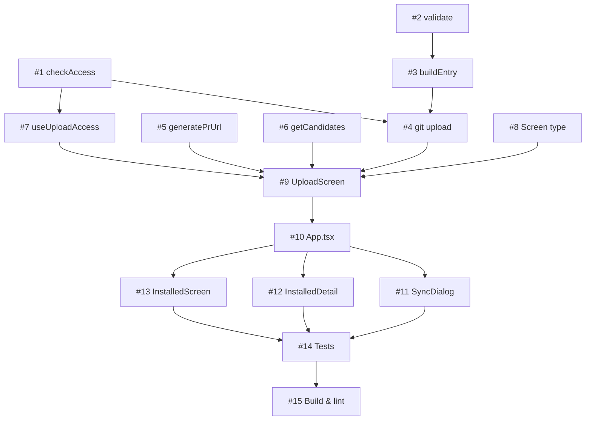

# План реализации: Загрузка расширений в каталог

## Обзор

Фича добавляет возможность загружать расширения (skills, agents, commands) в репозиторий каталога через `git push` + создание PR/MR в браузере. Реализация состоит из 3 логических слоёв:

1. **Core-логика** (`upload.ts`) — проверка доступа, валидация, git-операции, генерация URL.
2. **TUI-экран** (`UploadScreen.tsx`) — интерактивный выбор и загрузка.
3. **Интеграция** — точки входа из ExtensionSyncDialog, InstalledDetailScreen, InstalledScreen.

## Задачи

### Блок 1 — Core-логика (последовательно)

| # | Задача | Файлы | Зависит от | Режим выполнения | Проверка |
|---|--------|-------|------------|------------------|----------|
| 1 | **Проверка write-доступа к каталогу.** Функция `checkCatalogWriteAccess(registryUrl): Promise<{ hasAccess: boolean; error?: string }>`. Использует `simple-git` для `git push --dry-run` к URL каталога. Обрабатывает ошибки: нет прав, сетевая ошибка, невалидный URL. Поддержка SSH и HTTPS. | `cli/src/upload.ts` | — | sequential | Юнит-тесты: mock simple-git, проверить возвращаемые значения |
| 2 | **Валидация расширений перед загрузкой.** Функция `validateExtensionsForUpload(extensions: ScanResult[], catalog: Catalog): ValidationResult[]`. Проверки: наличие файла, фронтматтер (name, description, version, author), уникальность имени в catalog.json, kebab-case имя. Возвращает массив ошибок по каждому расширению. | `cli/src/upload.ts` | — | sequential | Юнит-тесты: валидные/невалидные расширения |
| 3 | **Формирование записи каталога.** Функция `buildCatalogEntry(scanResult: ScanResult, frontmatter: Frontmatter, agent: AgentName): Extension`. Создаёт объект Extension из метаданных расширения на диске для вставки в `catalog.json`. | `cli/src/upload.ts` | 2 | sequential | Юнит-тесты: проверить соответствие формату catalog.json |
| 4 | **Git-операции загрузки.** Функция `uploadExtensions(opts: UploadOptions): Promise<UploadResult>`. Полный цикл: создание ветки → копирование файлов → обновление catalog.json → commit → push → возврат на main. Использует `simple-git` в кеше `~/.skill-hub/`. | `cli/src/upload.ts` | 1, 3 | sequential | Интеграционные тесты: mock fs + simple-git |
| 5 | **Генерация URL для создания PR/MR.** Функция `generatePrUrl(registryUrl, branch, title, body): string`. Определяет платформу по URL (github.com, gitlab.com, fallback). Формирует URL с параметрами title и body. | `cli/src/upload.ts` | — | sequential | Юнит-тесты: GitHub URL, GitLab URL, unknown platform |
| 6 | **Получение списка расширений для загрузки.** Функция `getUploadCandidates(agent, scope, catalog): ScanResult[]`. Вызывает `adapter.scanInstalled()`, фильтрует по scope, исключает расширения, уже присутствующие в каталоге. | `cli/src/upload.ts` | — | sequential | Юнит-тесты: фильтрация по scope и каталогу |

### Блок 2 — TUI хук и экран (последовательно, после Блока 1)

| # | Задача | Файлы | Зависит от | Режим выполнения | Проверка |
|---|--------|-------|------------|------------------|----------|
| 7 | **Хук useUploadAccess.** Проверяет write-доступ при монтировании, кеширует результат в React state. Предоставляет `{ hasAccess, loading, error, recheck() }`. | `cli/src/tui/hooks/useUploadAccess.ts` | 1 | sequential | Ручная проверка: TUI запуск с/без доступа |
| 8 | **Добавить тип Screen `'upload'` в навигацию.** Расширить тип `Screen` в `useNavigation.ts`. | `cli/src/tui/hooks/useNavigation.ts` | — | sequential | `npm run build` |
| 9 | **Экран UploadScreen.** Компонент React/Ink: список расширений с чекбоксами, переключатель scope, превью содержимого (c), редактирование имени ветки (b) и заголовка PR (e), подтверждение (Enter), отмена (Esc). Интеграция с `upload.ts` функциями. Принимает опциональные `preselected` расширения через пропсы. | `cli/src/tui/screens/UploadScreen.tsx` | 4, 5, 6, 7, 8 | sequential | Ручная проверка: полный flow загрузки |
| 10 | **Регистрация UploadScreen в App.tsx.** Добавить рендеринг UploadScreen при `currentScreen === 'upload'`, передать пропсы (agent, onBack, preselected). Добавить state для preselected расширений. | `cli/src/tui/App.tsx` | 9 | sequential | `npm run build`, ручная проверка навигации |

### Блок 3 — Точки входа (параллельно, после Блока 2)

| # | Задача | Файлы | Зависит от | Режим выполнения | Проверка |
|---|--------|-------|------------|------------------|----------|
| 11 | **Кнопка «Загрузить в каталог» в ExtensionSyncDialog.** Если есть untracked расширения с `inCatalog === false` и `hasAccess === true` — показать действие (hotkey `u`). При переходе — предвыбрать все такие расширения в scope проекта. | `cli/src/tui/components/ExtensionSyncDialog.tsx` | 10 | parallel-subagent | Ручная проверка: sync с untracked расширениями |
| 12 | **Действие «Загрузить в каталог» в InstalledDetailScreen.** Если расширение не в каталоге и `hasAccess === true` — показать в списке действий. При переходе — предвыбрать это расширение. | `cli/src/tui/screens/InstalledDetailScreen.tsx` | 10 | parallel-subagent | Ручная проверка: деталька расширения не из каталога |
| 13 | **Hotkey для UploadScreen в InstalledScreen.** Добавить hotkey (например `u`) для перехода на UploadScreen из вкладки Installed. Показывать только если `hasAccess === true`. | `cli/src/tui/screens/InstalledScreen.tsx` | 10 | parallel-subagent | Ручная проверка: hotkey на вкладке Installed |

### Блок 4 — Финализация (последовательно, после Блока 3)

| # | Задача | Файлы | Зависит от | Режим выполнения | Проверка |
|---|--------|-------|------------|------------------|----------|
| 14 | **Тесты.** Покрыть юнит-тестами core-логику из `upload.ts`: checkCatalogWriteAccess, validateExtensionsForUpload, buildCatalogEntry, generatePrUrl, getUploadCandidates. | `cli/src/__tests__/upload.test.ts` | 1-6 | sequential | `npm test` |
| 15 | **Сборка и lint.** Убедиться, что `npm run build` и `npm test` проходят без ошибок. Обновить CLAUDE.md если нужно. | — | 14 | sequential | `npm run build && npm test` |

## Стратегия выполнения

1. **Блок 1** (задачи 1–6): core-логика, строго по порядку. Задачи 1, 2, 5, 6 не зависят друг от друга по данным, но все пишутся в один файл `upload.ts` — выполнять последовательно для чистоты.
2. **Блок 2** (задачи 7–10): TUI-часть, строго последовательно — каждая задача зависит от предыдущей.
3. **Блок 3** (задачи 11–13): три точки входа — **параллельно** субагентами, т.к. затрагивают разные файлы без пересечений.
4. **Блок 4** (задачи 14–15): финальные проверки, строго последовательно.

## Ревью после каждого шага

> Инструкция для исполнителя (дублируется в starter-prompt):
>
> - После каждой задачи — сверка с `plan.md` и `spec.md` (скоуп, критерии приёмки).
> - Проверка, что изменения не конфликтуют с параллельно выполняемыми задачами (одни и те же файлы, противоречивая логика).
> - Если задачу делал субагент — основной агент проводит ревью результата перед следующим шагом.
> - После задач 1–6: `npm run build` для проверки компиляции.
> - После задачи 10: ручной запуск TUI и проверка навигации на UploadScreen.
> - После задач 11–13: ручной запуск TUI и проверка каждой точки входа.
> - После задачи 14: `npm test` должен проходить.
