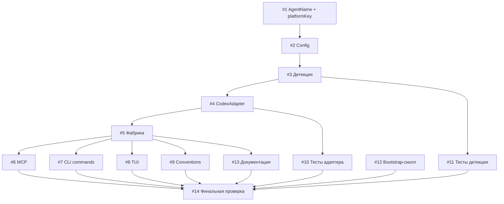

# План реализации: Подключение Codex

## Обзор

Добавление Codex как нового агента затрагивает ~30 файлов, но большинство изменений — механические (добавление `'codex'` в массивы и enum'ы). Ядро — создание `CodexAdapter` по образцу `CopilotAdapter`. Задачи сгруппированы в 5 блоков: ядро типов → адаптер → CLI/MCP → TUI → тесты и документация.

## Задачи

### Блок 1 — Ядро типов и конфигурация (последовательно)

| # | Задача | Файлы | Зависит от | Режим выполнения | Проверка |
|---|--------|-------|------------|------------------|----------|
| 1 | Добавить `'codex'` в `AgentName` union-тип и обновить `platformKey()` — для `'codex'` возвращать `'claude-code'` | `cli/src/catalog.ts` | — | sequential | `npm run build` |
| 2 | Добавить `'codex'` в `DEFAULT_CONFIG.aiAgents.agents` и `'.codex'` в `AGENT_SCOPE_MARKERS` | `cli/src/config.ts` | 1 | sequential | `npm run build` |
| 3 | Добавить детекцию Codex: env vars `CODEX_SANDBOX` / `CODEX_SANDBOX_NETWORK_DISABLED` → `'codex'`, `.codex/` директория → `'codex'`. Приоритет: после copilot, до fallback claude-code. Расширить `DetectOptions` для `.codex/` dir | `cli/src/detect-agent.ts` | 1 | sequential | `npm run build` |

### Блок 2 — Адаптер CodexAdapter (последовательно после #3)

| # | Задача | Файлы | Зависит от | Режим выполнения | Проверка |
|---|--------|-------|------------|------------------|----------|
| 4 | Создать `CodexAdapter` по образцу `CopilotAdapter`. HTML-маркеры `<!-- skill-hub: {name} -->`. Global: `~/.codex/AGENTS.md`, Project: `.codex/AGENTS.md`. Конструктор: `(projectDir, homeDir)`. Методы: `getSourceFile()` (через `platformKey` → `'claude-code'` → `'SKILL.md'`), `install()` (stripFrontmatter + инъекция), `remove()` (indexOf маркеров), `isInstalled()`, `scanInstalled()` (regex оба scope) | `cli/src/adapters/codex.ts` | 3 | sequential | `npm run build` |
| 5 | Зарегистрировать `CodexAdapter` в фабрике: `if (agent === 'codex') return new CodexAdapter()` перед fallback на `ClaudeCodeAdapter` | `cli/src/adapters/get-adapter.ts` | 4 | sequential | `npm run build` |

### Блок 3 — CLI и MCP (параллельно после #5)

| # | Задача | Файлы | Зависит от | Режим выполнения | Проверка |
|---|--------|-------|------------|------------------|----------|
| 6 | Обновить MCP-сервер: добавить `'codex'` в enum всех 7 инструментов (`search_extensions`, `install_extension`, `remove_extension`, `move_extension`, `list_extensions`, `suggest_extensions`, `get_extension_info`) | `cli/src/mcp.ts` | 5 | parallel-subagent | `npm run build` |
| 7 | Обновить CLI: справочные тексты в `index.ts` + тексты `--agent` опций во всех командах (`search`, `install`, `remove`, `list`, `move`, `update`, `info`, `agents-conventions`) | `cli/src/index.ts`, `cli/src/commands/search.ts`, `cli/src/commands/install.ts`, `cli/src/commands/remove.ts`, `cli/src/commands/list.ts`, `cli/src/commands/move.ts`, `cli/src/commands/update.ts`, `cli/src/commands/info.ts`, `cli/src/commands/agents-conventions.ts` | 5 | parallel-subagent | `npm run build` |

### Блок 4 — TUI и Conventions (параллельно после #5)

| # | Задача | Файлы | Зависит от | Режим выполнения | Проверка |
|---|--------|-------|------------|------------------|----------|
| 8 | Обновить TUI: добавить `'codex'` в `AGENTS` и `AI_AGENTS` (SettingsScreen), `AgentFilter` и `AGENT_FILTERS` (InstalledScreen), `realAgents` (useRegistry), `AI_AGENTS` (AiAgentsTab) | `cli/src/tui/screens/SettingsScreen.tsx`, `cli/src/tui/screens/InstalledScreen.tsx`, `cli/src/tui/hooks/useRegistry.ts`, `cli/src/tui/screens/settings/AiAgentsTab.tsx` | 5 | parallel-subagent | `npm run build` |
| 9 | Обновить conventions: добавить symlinks для `.codex/` в `SYMLINK_TARGETS`, thin pointer для `.codex/AGENTS.md` в `ROOT_AI_CONFIGS`, проверить/обновить валидацию агентов | `cli/src/conventions.ts` | 5 | parallel-subagent | `npm run build` |

### Блок 5 — Тесты, bootstrap-скилл, документация (параллельно после блоков 3-4)

| # | Задача | Файлы | Зависит от | Режим выполнения | Проверка |
|---|--------|-------|------------|------------------|----------|
| 10 | Написать unit-тесты для `CodexAdapter`: install (project + global), remove, isInstalled, scanInstalled. Паттерн из `copilot.test.ts` — tmpdir, beforeEach/afterEach cleanup | `cli/src/adapters/codex.test.ts` | 4 | parallel-subagent | `npm test` |
| 11 | Добавить тесты детекции Codex в `detect-agent.test.ts`: env var `CODEX_SANDBOX`, `.codex/` директория, приоритет относительно copilot/claude-code | `cli/src/detect-agent.test.ts` | 3 | parallel-subagent | `npm test` |
| 12 | Создать bootstrap-скилл `base-skills/codex/SKILL.md` по аналогии с `base-skills/copilot/SKILL.md` — инструкция для Codex-агента как пользоваться skill-hub через MCP или CLI | `cli/base-skills/codex/SKILL.md` | — | parallel-subagent | визуальная проверка |
| 13 | Обновить `CLAUDE.md`: таблица агентов (добавить codex), таблица директорий scope (global/project для codex), архитектура detect-agent, адаптеры | `CLAUDE.md` | 5 | parallel-subagent | визуальная проверка |

### Блок 6 — Финальная проверка (последовательно после всех)

| # | Задача | Файлы | Зависит от | Режим выполнения | Проверка |
|---|--------|-------|------------|------------------|----------|
| 14 | Полная сборка + все тесты + smoke-тест CLI (`skill-hub search --agent codex`) | — | 6, 7, 8, 9, 10, 11, 12, 13 | sequential | `npm run build && npm test` |

## Стратегия выполнения

1. **Последовательно:** задачи #1 → #2 → #3 → #4 → #5 (ядро, адаптер, фабрика — строгая цепочка зависимостей).
2. **Параллельно после #5:** задачи #6, #7, #8, #9 (CLI/MCP, TUI, conventions — независимы друг от друга, разные файлы).
3. **Параллельно после зависимостей:** задачи #10, #11, #12, #13 (тесты, скилл, документация — независимы).
4. **Последовательно в конце:** задача #14 — финальная сборка и проверка.

## Ревью после каждого шага

> - После каждой задачи — сверка с `plan.md` и `spec.md` (скоуп, критерии приёмки).
> - Проверка, что изменения не конфликтуют с параллельно выполняемыми задачами (одни и те же файлы, противоречивая логика).
> - Если задачу делал субагент — основной агент проводит ревью результата перед следующим шагом.
> - После блока параллельных задач (#6-#9 и #10-#13) — общая проверка сборки перед переходом к следующему блоку.
