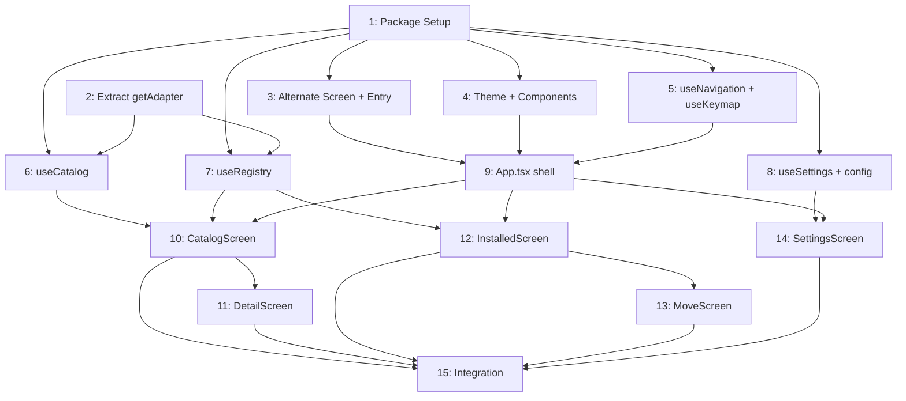

# План реализации: Interactive CLI

## Обзор

Добавляем полноценный TUI-режим на базе **Ink v3** (React для терминала, CJS-совместимый) с ручной реализацией alternate screen через ANSI escape-коды. Гибридный запуск: `skill-hub` без аргументов → TUI, с аргументами → Commander как прежде. 15 задач, ~21 новый файл + ~9 модифицированных.

**Ключевое решение:** Ink v3.2.0 (последний CJS) + React 17. Alternate screen — вручную (`\x1b[?1049h/l`). Миграция на ESM не требуется.

## Задачи

### Блок A — Setup (параллельно)

| # | Задача | Файлы | Зависит от | Режим | Проверка |
|---|--------|-------|------------|-------|----------|
| 1 | Установить зависимости (ink@3, react@17, @types/react@17, ink-testing-library@2), настроить `"jsx": "react-jsx"` в tsconfig, обновить Jest testMatch для .tsx | `cli/package.json`, `cli/tsconfig.json` | — | sequential | `npx tsc --noEmit`, `npm test` |
| 2 | Извлечь `getAdapter()` в `cli/src/adapters/get-adapter.ts` (сейчас скопирован в 6 файлах) — обновить все импорты | `cli/src/adapters/get-adapter.ts` (новый), `commands/install.ts`, `commands/remove.ts`, `commands/move.ts`, `commands/list.ts`, `commands/update.ts`, `mcp.ts` | — | parallel-same | `npm run build`, `npm test`, `skill-hub search git` |

### Блок B — Core Infrastructure (после Блока A)

| # | Задача | Файлы | Зависит от | Режим | Проверка |
|---|--------|-------|------------|-------|----------|
| 3 | Alternate screen обёртка + гибридный entry point: `tui/index.ts` (ANSI escape, ink.render), модификация `index.ts` (if no args → TUI) | `cli/src/tui/index.ts` (новый), `cli/src/index.ts` | 1 | sequential | `skill-hub` → пустой fullscreen, `skill-hub search git` работает, `q` восстанавливает терминал |
| 4 | Тема + shared-компоненты: `theme.ts`, `Header.tsx`, `HintBar.tsx`, `StatusBar.tsx`, `Confirm.tsx`, `ExtensionList.tsx`, `SearchInput.tsx`, `FilterBar.tsx` | `cli/src/tui/theme.ts`, `cli/src/tui/components/*.tsx` (7 файлов) | 1 | parallel-subagent | Тесты компонентов, `npm run build` |
| 5 | Хуки `useNavigation` (табы + stack) и `useKeymap` (диспетчер клавиш с контекстом) | `cli/src/tui/hooks/useNavigation.ts`, `cli/src/tui/hooks/useKeymap.ts` | 1 | parallel-subagent | Тесты хуков |
| 6 | Хук `useCatalog` — обёртка `catalog.ts` с debounce-поиском и фильтрами | `cli/src/tui/hooks/useCatalog.ts` | 1, 2 | sequential | Тест хука |
| 7 | Хук `useRegistry` — обёртка `registry.ts` + адаптеры для install/remove/move/update | `cli/src/tui/hooks/useRegistry.ts` | 1, 2 | sequential | Тест хука |
| 8 | Хук `useSettings` + модуль `config.ts` — загрузка/сохранение `~/.skill-hub/config.json` | `cli/src/config.ts` (новый), `cli/src/tui/hooks/useSettings.ts` | 1 | parallel-subagent | Тесты config + hook |

### Блок C — App Shell (после Блока B)

| # | Задача | Файлы | Зависит от | Режим | Проверка |
|---|--------|-------|------------|-------|----------|
| 9 | `App.tsx` — корневой компонент: Header, routing по табам/стеку, StatusContext, HintBar, глобальные hotkey (q, Ctrl+C, Tab, 1-3) | `cli/src/tui/App.tsx`, `cli/src/tui/contexts/StatusContext.ts` | 3, 4, 5 | sequential | `skill-hub` → табы, переключение, HintBar, выход |

### Блок D — Screens (после Блока C, частично параллельно)

| # | Задача | Файлы | Зависит от | Режим | Проверка |
|---|--------|-------|------------|-------|----------|
| 10 | CatalogScreen — поиск, фильтры, список, навигация, install по `i` | `cli/src/tui/screens/CatalogScreen.tsx` | 6, 7, 9 | sequential | Каталог отображается, поиск фильтрует, `i` устанавливает |
| 11 | DetailScreen — карточка расширения, install/remove действия | `cli/src/tui/screens/DetailScreen.tsx` | 10 | sequential | Enter из каталога → детали, Esc → назад |
| 12 | InstalledScreen — список установленных, delete/move/update | `cli/src/tui/screens/InstalledScreen.tsx` | 7, 9 | parallel-subagent | Список отображается, `d` удаляет с подтверждением |
| 13 | MoveScreen — перенос scope (global ↔ project) | `cli/src/tui/screens/MoveScreen.tsx` | 12 | sequential | `m` из Installed → выбор scope → перенос |
| 14 | SettingsScreen — agent, scope, кэш, MCP | `cli/src/tui/screens/SettingsScreen.tsx` | 8, 9 | parallel-subagent | Настройки отображаются, изменения сохраняются |

### Блок E — Integration (после всех экранов)

| # | Задача | Файлы | Зависит от | Режим | Проверка |
|---|--------|-------|------------|-------|----------|
| 15 | E2E-проверка: build, тесты, все экраны, все hotkey, edge cases (пустой каталог, нет установленных, resize, clean exit) | По необходимости | 10, 11, 12, 13, 14 | sequential | Полный walkthrough + `npm test` + `npm run build` |

## Стратегия выполнения

**Порядок:**
1. **Задачи 1 и 2** — параллельно (setup + рефакторинг getAdapter)
2. **Задачи 3, 4, 5, 8** — параллельно после задачи 1; задачи **6, 7** — после задач 1+2
3. **Задача 9** — после задач 3, 4, 5 (App shell)
4. **Задачи 10, 12, 14** — параллельно после задачи 9 (независимые экраны)
5. **Задача 11** — после 10; **задача 13** — после 12 (вложенные экраны)
6. **Задача 15** — финальная интеграция

**Оптимальное распределение (3 агента):**
- Агент A: 1 → 3 → 9 → 10 → 11
- Агент B: 2 → 6 → 7 → 12 → 13
- Агент C: 4 → 5 → 8 → 14 → 15

## Ревью после каждого шага

- После каждой задачи — сверка с `plan.md` и `spec.md` (скоуп, критерии приёмки).
- Проверка, что изменения не конфликтуют с параллельно выполняемыми задачами (одни и те же файлы, противоречивая логика).
- Если задачу делал субагент — основной агент проводит ревью результата перед следующим шагом.

## Соответствие REQ → задачи

| REQ | Задачи |
|-----|--------|
| REQ-1 (гибридный запуск) | 3 |
| REQ-2 (fullscreen Ink) | 1, 3 |
| REQ-3 (CommonJS) | 1 |
| REQ-4 (Каталог) | 10 |
| REQ-5 (Установленные) | 12 |
| REQ-6 (Детали) | 11 |
| REQ-7 (Настройки) | 14 |
| REQ-8 (Перенос) | 13 |
| REQ-9 (hotkey) | 5, 9, 10-14 |
| REQ-10 (переиспользование) | 2, 6, 7, 8 |
| REQ-11 (обратная связь) | 4 (StatusBar, Confirm), 9 (StatusContext) |
