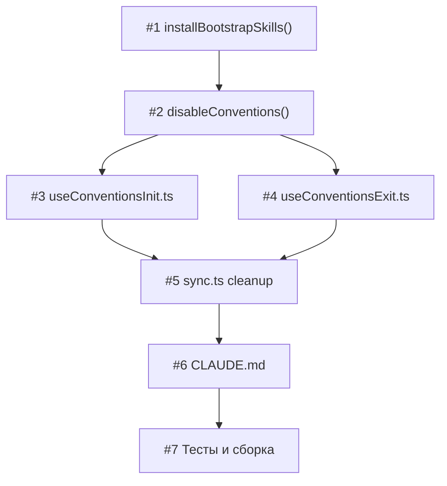

# План реализации: Перенос базовых скиллов

## Обзор

Фича затрагивает 5 файлов. Основное изменение — в `conventions.ts` (разделение `installBootstrapSkills` и изменение cleanup в `disableConventions`). Остальные изменения — обновление путей в промптах и cleanup `sync.ts`. Все изменения последовательны, кроме обновления двух TUI-хуков (параллельно).

## Задачи

### Блок 1 — Ядро: conventions.ts (последовательно)

| # | Задача | Файлы | Зависит от | Режим выполнения | Проверка |
|---|--------|-------|------------|------------------|----------|
| 1 | Модифицировать `installBootstrapSkills()`: для `init-agents` и `exit-agents` — целевой путь `~/.skill-hub/bootstrap/{name}/`, не регистрировать в registry; для `agents-conventions` — оставить без изменений (в `.agents/skills/`). Путь формировать через `path.join(os.homedir(), '.skill-hub', 'bootstrap')`. | `cli/src/conventions.ts` | — | sequential | `cd cli && npm run build` |
| 2 | Модифицировать `disableConventions()`: в секции «Удаление bootstrap-скиллов» (строки 764–771) — удалять только `agents-conventions` из `.agents/skills/`, **не** трогать `init-agents`/`exit-agents` в `~/.skill-hub/bootstrap/`. Аналогично в секции пропуска миграции (строка 701) — оставить skip для всех трёх. | `cli/src/conventions.ts` | 1 | sequential | `cd cli && npm run build` |

### Блок 2 — TUI промпты (параллельно после #2)

| # | Задача | Файлы | Зависит от | Режим выполнения | Проверка |
|---|--------|-------|------------|------------------|----------|
| 3 | В `useConventionsInit.ts`: заменить статическую строку `INIT_PROMPT` на динамическую с абсолютным путём. Импортировать `os` и `path`, сформировать путь `path.join(os.homedir(), '.skill-hub', 'bootstrap', 'init-agents', 'SKILL.md')`. Обновить `AUTO_ANALYSIS_ARGS` чтобы использовал динамический промпт — вынести в функцию `getAutoAnalysisArgs()`. | `cli/src/tui/hooks/useConventionsInit.ts` | 2 | parallel-same | `cd cli && npm run build` |
| 4 | В `useConventionsExit.ts`: аналогично — заменить `EXIT_PROMPT` на динамический путь через `os.homedir()`. Обновить `EXIT_ARGS` → `getExitArgs()`. | `cli/src/tui/hooks/useConventionsExit.ts` | 2 | parallel-same | `cd cli && npm run build` |

### Блок 3 — Cleanup и документация (после #3, #4)

| # | Задача | Файлы | Зависит от | Режим выполнения | Проверка |
|---|--------|-------|------------|------------------|----------|
| 5 | В `sync.ts`: убрать `'init-agents'` и `'exit-agents'` из `BASE_SKILLS` set. Оставить `'agents-conventions'` и `'skill-hub'`. | `cli/src/sync.ts` | 3, 4 | sequential | `cd cli && npm run build` |
| 6 | Обновить `CLAUDE.md`: в описании Conventions Mode и структуры base-skills — отразить новое расположение bootstrap-скиллов в `~/.skill-hub/bootstrap/`. | `CLAUDE.md` | 5 | sequential | — |

### Блок 4 — Валидация (после #6)

| # | Задача | Файлы | Зависит от | Режим выполнения | Проверка |
|---|--------|-------|------------|------------------|----------|
| 7 | Прогнать все тесты и сборку: `cd cli && npm run build && npm test`. Убедиться что нет регрессий. | — | 6 | sequential | `cd cli && npm run build && npm test` |

## Стратегия выполнения

Строгая цепочка: **#1 → #2 → (#3 ‖ #4) → #5 → #6 → #7**

Задачи #3 и #4 можно выполнить параллельно — они редактируют разные файлы и не пересекаются по логике.

## Ревью после каждого шага

> Инструкция для исполнителя (дублируется в starter-prompt):
>
> - После каждой задачи — сверка с `plan.md` и `spec.md` (скоуп, критерии приёмки).
> - Проверка, что изменения не конфликтуют с параллельно выполняемыми задачами (одни и те же файлы, противоречивая логика).
> - Если задачу делал субагент — основной агент проводит ревью результата перед следующим шагом.
