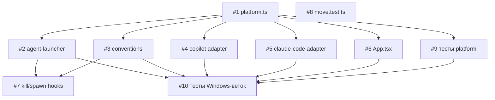

# План реализации: Поддержка Windows

## Обзор

Реализация разбита на 4 блока. Блок 1 (фундамент) — создание `platform.ts` — выполняется первым. Блок 2 (критические исправления) можно запускать параллельно после Блока 1. Блок 3 (средние и низкие) — после Блока 2. Блок 4 (тесты) — финал.

## Задачи

### Блок 1 — Фундамент (последовательно)

| # | Задача | Файлы | Зависит от | Режим выполнения | Проверка |
|---|--------|-------|------------|------------------|----------|
| 1 | Создать хелпер `platform.ts` с `isWindows`, `isMac`, `isLinux`, `getAppData()`, `pathsEqual()` (case-insensitive на Windows) | `cli/src/platform.ts` | — | sequential | `npm run build` |

### Блок 2 — Критические исправления (параллельно после #1)

| # | Задача | Файлы | Зависит от | Режим выполнения | Проверка |
|---|--------|-------|------------|------------------|----------|
| 2 | Windows-ветка в agent-launcher: exec-режим через `spawnSync(binary, args, { shell: true })`, script-режим через `.bat` с `@echo off`, `set`, `del`, CRLF-разделители | `cli/src/agent-launcher.ts` | 1 | parallel-subagent | `npm run build` |
| 3 | Symlinks в conventions: `fs.symlinkSync(target, link, 'dir')` → fallback на junction с `path.resolve()` → fallback на копирование. Нормализация путей в сравнении (строка ~422). Замена `'/'` на `path.sep` (строка ~135) | `cli/src/conventions.ts` | 1 | parallel-subagent | `npm run build` |
| 4 | Copilot Adapter: добавить `win32`-ветку с `process.env.APPDATA` для пути VS Code | `cli/src/adapters/copilot.ts` | 1 | parallel-subagent | `npm run build` |
| 5 | Claude Code Adapter: case-insensitive сравнение путей в цикле обхода родительских директорий через `pathsEqual()` из `platform.ts` | `cli/src/adapters/claude-code.ts` | 1 | parallel-subagent | `npm run build` |
| 6 | App.tsx: заменить `s.path.split('/').slice(-2).join('/')` на кроссплатформенный разбор через `path.basename(path.dirname(s.path))` + `path.basename(s.path)` | `cli/src/tui/App.tsx` | 1 | parallel-subagent | `npm run build` |

### Блок 3 — Средние и низкие (параллельно после Блока 2)

| # | Задача | Файлы | Зависит от | Режим выполнения | Проверка |
|---|--------|-------|------------|------------------|----------|
| 7 | Кроссплатформенный kill и spawn в хуках conventions: `kill()` без аргумента на Windows, `shell: true` при `isWindows` для spawn | `cli/src/tui/hooks/useConventionsInit.ts`, `cli/src/tui/hooks/useConventionsExit.ts` | 1 | parallel-same | `npm run build` |
| 8 | Исправить тест move.test.ts: мокать `os.homedir()` вместо `process.env.HOME` | `cli/src/commands/move.test.ts` | — | parallel-same | `npm test` |

### Блок 4 — Тесты (последовательно после всех)

| # | Задача | Файлы | Зависит от | Режим выполнения | Проверка |
|---|--------|-------|------------|------------------|----------|
| 9 | Написать unit-тесты для `platform.ts` | `cli/src/platform.test.ts` | 1 | sequential | `npm test` |
| 10 | Написать unit-тесты для Windows-веток: agent-launcher (генерация .bat, exec-режим), conventions (symlink fallback, path normalization), copilot adapter (win32 путь), claude-code (case-insensitive paths) | `cli/src/agent-launcher.test.ts`, `cli/src/conventions.test.ts`, `cli/src/adapters/copilot.test.ts`, `cli/src/adapters/claude-code.test.ts` | 2, 3, 4, 5, 6, 9 | sequential | `npm test` |

## Стратегия выполнения

1. **#1** (platform.ts) — фундамент, строго первым.
2. **#2, #3, #4, #5, #6** — параллельно субагентами (нет пересечения по файлам).
3. **#7, #8** — параллельно в одной сессии после Блока 2 (мелкие правки).
4. **#9** — тесты для platform.ts.
5. **#10** — тесты для всех Windows-веток, строго после завершения всех реализационных задач.

## Ревью после каждого шага

- После каждой задачи — сверка с `plan.md` и `spec.md` (скоуп, критерии приёмки).
- Проверка, что изменения не конфликтуют с параллельно выполняемыми задачами (одни и те же файлы, противоречивая логика).
- Если задачу делал субагент — основной агент проводит ревью результата перед следующим шагом.
- После Блока 2: запустить `npm run build` для проверки компиляции всех изменений вместе.
- После Блока 4: запустить `npm test` для полного прогона тестов.
